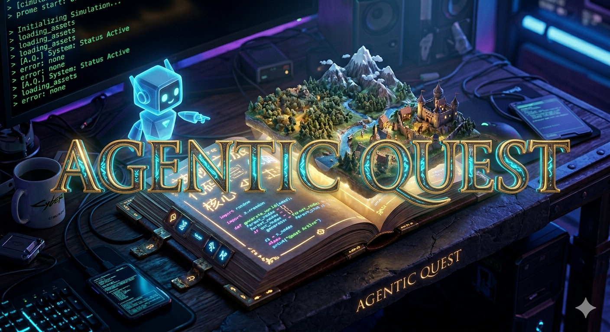
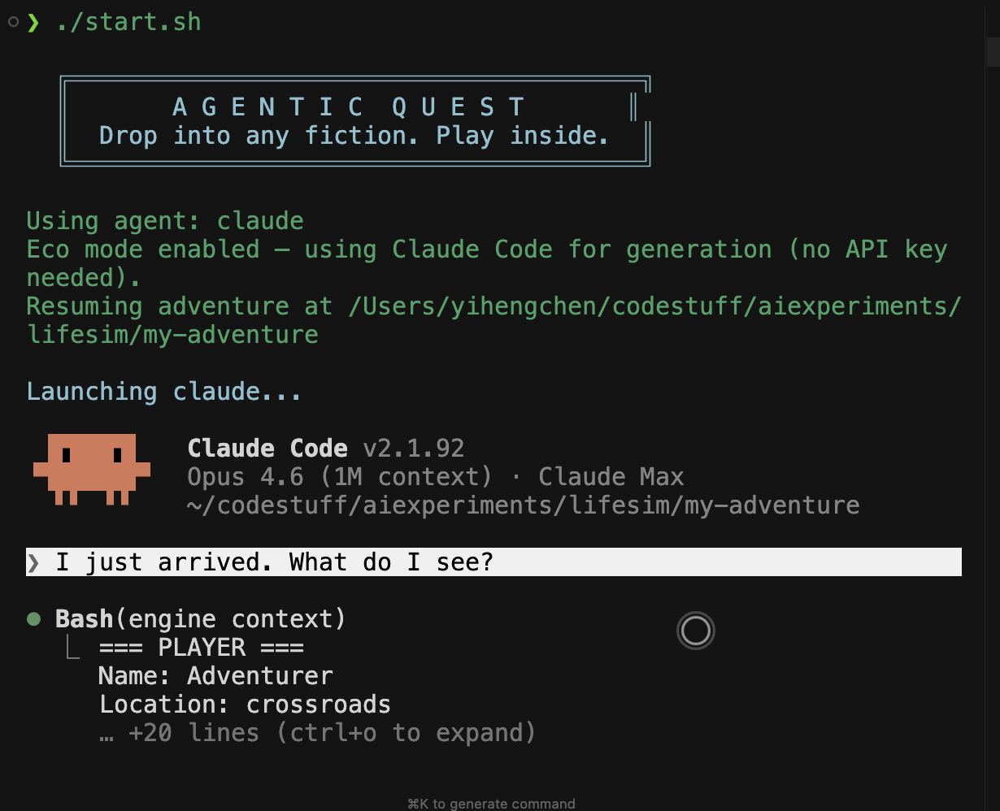
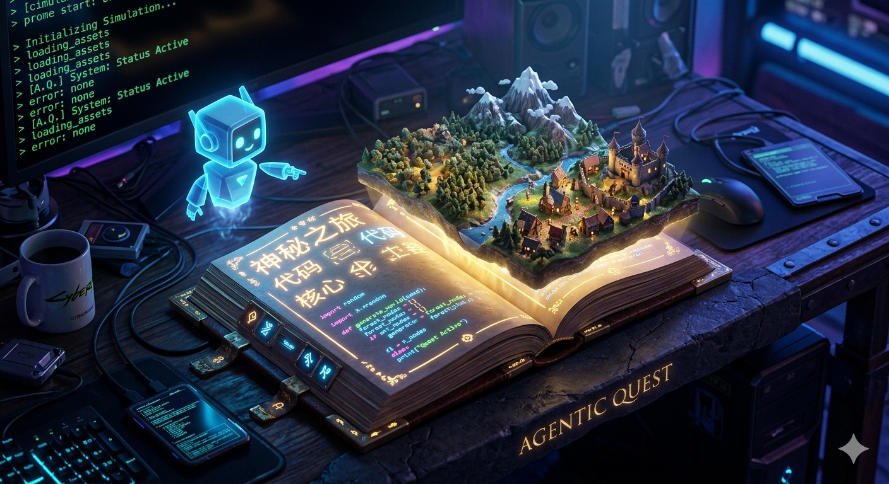

<div align="center">



**Drop in any fiction. Play inside the story.**

An LLM-powered text RPG where your puzzles are real code, your companions are AI agents, and the world generates around you. Works with Claude Code and Codex.

[Quick Start](#quick-start) | [Features](#what-makes-this-different) | [How It Works](#how-it-works) | [Source Worlds](#play-inside-any-fiction)

</div>

---

## Quick Start

```bash
git clone https://github.com/intelc/agentic-quest.git
cd agentic-quest
chmod +x start.sh
./start.sh
```

That's it. On first run, the script:
1. Creates `.env` from `.env.example` (eco mode on, auto-detects Claude Code or Codex)
2. Installs dependencies
3. Creates a fantasy adventure
4. Launches your agent with the game running

Edit `.env` to customize (switch agents, add API key, disable eco mode):



The first scene drops you into the world:

> **=== The Crossroads ===**
>
> You stand at a crossroads beneath an open sky, where three dirt paths converge under a canopy of nothing but pale blue and slow-drifting clouds. A weathered signpost leans beside you, its three wooden arms pointing in different directions — but the symbols carved into each have been worn smooth by years of wind and rain.
>
> A few paces away, an old merchant sits cross-legged on the ground, his wares spread across a threadbare blanket. He catches your eye and grins — a gap-toothed, knowing sort of grin. His goods are... unusual. A brass compass whose needle spins lazily with no regard for north. A glass vial that seems to hold a tiny, pulsing light. And a small leather-bound book with no title on its cover.
>
> **The Old Merchant** clears his throat. *"Ah, a fresh pair of boots on the road. Haven't seen a traveler in... well. Too long."* He gestures at his blanket. *"Care to browse? Or perhaps you're the sort who fixes things before they move on."* His eyes flick toward the broken signpost.
>
> **[A]** Examine the broken signpost — those faded symbols might still mean something
> **[B]** Approach the merchant — his wares are strange, and he seems to know things
> **[C]** "Lyra, scout ahead down that dark tree line." *(Send Lyra to scout the Dark Forest)*
> **[D]** Something else — describe what you'd like to do

Type a letter or describe what you want to do. The world responds.

---

## What Makes This Different

Every other AI RPG lets the LLM make up whether you succeed or fail. Agentic Quest doesn't.

**Puzzles are real programs.** Each puzzle is backed by a Python validator function. When you say "arrange the symbols: sun, moon, star" — the AI translates your logic into code, runs it against the validator, and it either passes or it doesn't. No hallucinated victories.

**Two ways to play.**
- **Story mode** — you never see code. Describe your reasoning in plain words. The AI handles the rest.
- **Technical mode** — see the validator, write the solution yourself. Same puzzles, different interface.

**Companions are real AI agents.** Your Scout dispatches an Explore subagent. Your Scholar runs a research query. Your Tinker writes code. They're not flavor text — they do actual work.

**The world adapts to you.** The engine tracks how you play — what puzzles you enjoy, how many attempts you need, whether you prefer exploration or combat. Future zones are generated to match.

**Drop in any fiction.** Pass a text file — a novel excerpt, a short story, a game setting doc in any language — and the entire world generates from it. Chinese wuxia, sci-fi, post-apocalyptic survival. The narration matches the source language.

---

## Play Inside Any Fiction

A sample Chinese fiction source is bundled — a time-travel/reincarnation story where you wake up 3 days before a catastrophic super-typhoon, with a magical jade pendant and a race to stockpile supplies:

```bash
# Try the bundled sample (Chinese apocalypse survival)
./start.sh my-endworld --source examples/endworld-sample.txt
```

The entire world generates in Chinese — locations, NPCs, dialogue, and puzzles all drawn from the source fiction.

**Bring your own fiction** — drop any text file and the world adapts:

```bash
# English sci-fi
./start.sh my-expanse --source my-expanse-excerpt.txt

# Japanese light novel
./start.sh my-isekai --source isekai-chapter1.txt

# Any language, any genre — just a .txt file
./start.sh my-world --source your-fiction.txt
```

The source text becomes the DNA of your world. Locations, characters, tone, and puzzles are all grounded in the fiction. Narration matches the source language automatically.

---

## How It Works

<div align="center">

</div>

```
┌─────────────────────────────────────────────────┐
│  AI Coding Agent (narrator)                     │
│  Reads CLAUDE.md → voices NPCs → narrates world │
│  ↕ calls engine commands via shell              │
├─────────────────────────────────────────────────┤
│  Engine CLI (Python)                            │
│  State · Validators · Generation · Profiles     │
│  ↕ reads/writes game files                      │
├─────────────────────────────────────────────────┤
│  Game Directory (files)                         │
│  world/  →  zones, puzzles, NPCs as YAML/Python │
│  player/ →  inventory, companions, profile      │
└─────────────────────────────────────────────────┘
```

The game is a folder. Your AI coding agent reads `CLAUDE.md` and becomes the game master. It calls `engine` commands to manage state — move, solve puzzles, talk to NPCs, generate new zones. The engine enforces rules; the AI handles narrative.

```
my-adventure/
├── CLAUDE.md           # Instructions (Claude Code)
├── AGENTS.md           # Instructions (Codex) — same content
├── .claude/            # Claude Code permissions
├── .codex/             # Codex permissions
├── world/
│   ├── crossroads/     # Each zone is a folder
│   │   ├── zone.yaml       # Connections, NPCs, puzzles
│   │   ├── narrative.md     # What the AI reads to you
│   │   └── broken_signpost/
│   │       ├── puzzle.yaml      # Narrative framing
│   │       ├── validate.py      # Real Python validator
│   │       └── solution_stub.py # Function to complete
│   └── (more zones generated as you explore)
└── player/
    ├── state.yaml      # Location, inventory, companions
    ├── profile.yaml    # How the game adapts to you
    └── companions/     # Scout, Scholar, Tinker, Cartographer
```

---

## Commands

The AI calls these automatically. In technical mode, you can run them yourself.

| Command | What it does |
|---------|-------------|
| `engine context` | Everything at once (session start) |
| `engine look` | Describe current zone |
| `engine paths` | Available directions |
| `engine move <zone>` | Go somewhere (auto-generates if needed) |
| `engine puzzle` | Current puzzle details |
| `engine solve <id> --solution <file>` | Submit a solution |
| `engine hint <id>` | Get a narrative hint |
| `engine talk <npc>` | Talk to an NPC |
| `engine add-item <item>` | Pick up an item |
| `engine scout <zone_id>` | Scout companion scans ahead |
| `engine research <topic>` | Scholar companion investigates |
| `engine craft <desc>` | Tinker companion builds |
| `engine map` | Show explored world |
| `engine schedule <desc> --after <N>` | Schedule a future event |
| `engine check-achievements` | Check for new achievements |
| `engine say <text>` | Read aloud (macOS) |

---

## Modes

```bash
# Story mode (default) — pure narrative, no code visible
./start.sh my-adventure --mode story

# Technical mode — see validators, write solutions
./start.sh my-adventure --mode technical
```

**Story mode** is the "vibecoding for everyone" experience. You describe your thinking — "the sun comes first because it's the source of light, then the moon reflects it, then the star is farthest away" — and the AI translates that into a function that the validator checks. You never see a line of code.

**Technical mode** shows you the `validate.py` and `solution_stub.py`. You write the function yourself, or describe the logic and let the AI write it. Same puzzles, transparent mechanics.

---

## Supported Agents

| Agent | Status | Install |
|-------|--------|---------|
| **[Claude Code](https://claude.ai/download)** | Fully supported | `brew install claude-code` or [download](https://claude.ai/download) |
| **[Codex](https://openai.com/codex)** | Fully supported | `npm install -g @openai/codex` |

The script auto-detects which agent you have installed. Override with `AQ_AGENT=codex` or `AQ_AGENT=claude` in `.env`.

## Configuration (`.env`)

On first run, `start.sh` creates `.env` from `.env.example`. Edit to customize:

```bash
# Agent harness: "claude" (recommended) or "codex"
AQ_AGENT=claude

# Eco mode: uses your agent CLI for world generation (no API key needed)
ECO=on

# Anthropic API key (only needed if ECO=off)
# ANTHROPIC_API_KEY=sk-ant-...
```

| Setting | Options | What it does |
|---------|---------|-------------|
| `AQ_AGENT` | `claude` (recommended), `codex` | Which AI coding agent to use |
| `ECO` | `on` (default), `off` | Free CLI-based generation vs direct API |
| `ANTHROPIC_API_KEY` | your key | Only needed when `ECO=off` |

---

## Requirements

- **Python 3.11+**
- **[Claude Code](https://claude.ai/download)** or **[Codex](https://openai.com/codex)**

---

## What's Next

- [ ] RAG pipeline for full novels (play inside entire books, not just excerpts)
- [ ] More presets (sci-fi, post-apocalyptic, historical, mystery)
- [ ] Multiplayer shared worlds
- [ ] Web interface alongside CLI
- [ ] Community preset & fiction source marketplace

---

<div align="center">

Built for agentic coding tools

</div>
